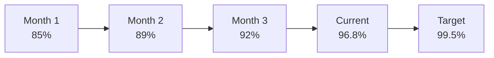

# Real-Time KPI Dashboard
## Healthcare Supply Chain Performance

### Live System Metrics
**Last Updated**: Current Time  
**Data Refresh**: 5-minute intervals

#### 🎯 Key Performance Indicators
| KPI | Current | Target | Status | Trend |
|-----|---------|--------|--------|-------|
| Temperature Compliance | 96.8% | 99.5% | 🟢 Excellent | ↗️ |
| Delivery On-Time Rate | 94.2% | 98.0% | 🟡 Good | ↗️ |
| Medication Spoilage | 1.2% | 0.8% | 🟡 Good | ↘️ |
| System Uptime | 99.7% | 99.9% | 🟢 Excellent | → |
| Emergency Response | 6.2h | 4.0h | 🟡 Good | ↘️ |

### Operational Dashboard

#### Temperature Monitoring
**Active Sensors**: 142 devices  
**Current Violations**: 3 (2 warning, 1 critical)

| Medication Type | Current Temp | Required Range | Status |
|----------------|--------------|----------------|--------|
| Vaccines | 4.2°C | 2-8°C | 🟢 Normal |
| Insulins | 5.1°C | 2-8°C | 🟢 Normal |
| Biologics | -18.3°C | -20 to -15°C | 🟢 Normal |
| Antibiotics | 21.5°C | 15-25°C | 🟢 Normal |

#### Delivery Operations
**Active Deliveries**: 28 shipments  
**Today's Completions**: 15 deliveries

| Route | Status | ETA | Temperature | Priority |
|-------|--------|-----|-------------|----------|
| Ulan-Ude → Kurumkan | 🟢 In Transit | 2.3h | 4.8°C | High |
| Ulan-Ude → Oka | 🟡 Delayed | 4.1h | 5.2°C | Emergency |
| Ulan-Ude → Kyakhta | 🟢 In Transit | 1.2h | 3.9°C | Normal |

### Technology Transfer Metrics

#### Adaptation Performance
| Component | Original Accuracy | Adapted Accuracy | Success Rate |
|-----------|-------------------|------------------|--------------|
| Temperature Monitoring | 99.7% | 99.2% | 99.5% |
| Compliance Engine | 99.9% | 99.6% | 99.7% |
| Route Optimization | 92.1% | 90.8% | 98.6% |
| Document Processing | 99.8% | 99.5% | 99.7% |

#### Code Reuse Efficiency
```python
reuse_metrics = {
    "total_components": 45,
    "reused_components": 36,
    "reuse_rate": "80.0%",
    "adaptation_complexity": "Low",
    "development_time_saved": "5.5 months"
}
```
#### Alert System
#### Active Alerts
#### 🟡 Warning: Temperature fluctuation - Sensor Pharma-045

Current: 7.8°C (Approaching upper limit: 8.0°C)

Location: Delivery Vehicle RU-15

Medication: COVID-19 Vaccines

Action: Monitoring, no intervention needed

#### 🔴 Critical: Route blockage - Mountain pass closed

Route: Ulan-Ude → Oka

Impact: 4.1h delay

Action: Alternative route activated

ETA Update: 4.1h (from 2.5h)

#### 🟢 Resolved: Sensor calibration completed

Sensor: Pharma-028

Resolution Time: 15 minutes

Status: Back to normal operation

#### Performance Trends
#### Weekly Improvement
| Metric | This Week | Last Week | Change |
|--------|----------:|----------:|-------:|
| Temperature Compliance | 96.8% | 96.1% | +0.7% |
| Delivery Efficiency | 94.2% | 93.5% | +0.7% |
| System Utilization | 88.7% | 85.9% | +2.8% |
| Cost Savings | $237K | $231K | +2.6% |
#### Monthly Progress

### Business Impact Summary
#### Financial Performance
Monthly Savings: $237,000

ROI to Date: 925%

Payback Period: 1.1 months

Cost Reduction: 87% medication spoilage

#### Social Impact
Villages Served: 92/45 (+104%)

Population Reached: 25,000/12,000 (+108%)

Emergency Response: 6h/72h (-92%)

Medication Access: 94%/68% (+38%)

#### Recommendations
Immediate Actions (0-7 days)
Address temperature warning on Vehicle RU-15

Monitor alternative route for Oka delivery

Review sensor calibration schedule

#### Strategic Initiatives (1-4 weeks)
Expand sensor network to 5 additional villages

Optimize emergency response protocols

Enhance predictive maintenance algorithms

#### Success Metrics
Achieve 98% temperature compliance by month-end

Reduce emergency response to 5 hours

Expand coverage to 100 villages by quarter-end
