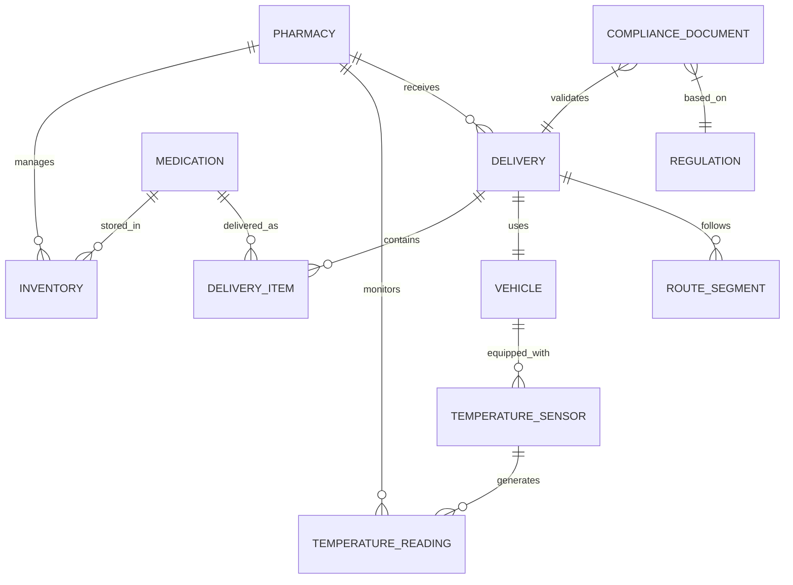

# Data Models

## Core Entity Relationships


## Core Data Models
## Pharmacy Entity
```sql
CREATE TABLE pharmacies (
    id UUID PRIMARY KEY,
    name VARCHAR(255) NOT NULL,
    address JSONB NOT NULL,
    gps_coordinates POINT NOT NULL,
    contact_phone VARCHAR(20),
    contact_email VARCHAR(255),
    operating_hours JSONB,
    storage_capacity INTEGER, -- in cubic meters
    temperature_zones JSONB, -- { "vaccines": [2,8], "insulin": [2,8] }
    created_at TIMESTAMP DEFAULT NOW(),
    updated_at TIMESTAMP DEFAULT NOW()
);
```
## Medication Entity
```sql
CREATE TABLE medications (
    id UUID PRIMARY KEY,
    name VARCHAR(255) NOT NULL,
    generic_name VARCHAR(255),
    manufacturer VARCHAR(255),
    medication_type VARCHAR(50) NOT NULL, -- vaccine, insulin, antibiotic, etc.
    temperature_requirements JSONB NOT NULL, -- { "min": 2, "max": 8, "unit": "celsius" }
    shelf_life_days INTEGER,
    regulatory_classification VARCHAR(100),
    barcode VARCHAR(100),
    requires_prescription BOOLEAN DEFAULT FALSE,
    created_at TIMESTAMP DEFAULT NOW()
);
```
## Inventory Entity
```sql
CREATE TABLE inventory (
    id UUID PRIMARY KEY,
    pharmacy_id UUID REFERENCES pharmacies(id),
    medication_id UUID REFERENCES medications(id),
    batch_number VARCHAR(100) NOT NULL,
    quantity INTEGER NOT NULL,
    expiry_date DATE NOT NULL,
    storage_zone VARCHAR(50), -- vaccines, insulin, room_temp, etc.
    current_temperature DECIMAL(4,2),
    temperature_status VARCHAR(20) DEFAULT 'normal', -- normal, warning, critical
    last_temperature_check TIMESTAMP,
    created_at TIMESTAMP DEFAULT NOW(),
    updated_at TIMESTAMP DEFAULT NOW()
);
```
## Temperature Monitoring Models
## Temperature Sensor
```sql
CREATE TABLE temperature_sensors (
    id UUID PRIMARY KEY,
    device_id VARCHAR(100) UNIQUE NOT NULL,
    pharmacy_id UUID REFERENCES pharmacies(id),
    vehicle_id UUID REFERENCES vehicles(id),
    sensor_type VARCHAR(50) NOT NULL, -- storage, transport, backup
    location_description VARCHAR(255),
    calibration_date DATE,
    next_calibration_date DATE,
    status VARCHAR(20) DEFAULT 'active',
    created_at TIMESTAMP DEFAULT NOW()
);
```
## Temperature Reading
```sql
CREATE TABLE temperature_readings (
    id UUID PRIMARY KEY,
    sensor_id UUID REFERENCES temperature_sensors(id),
    temperature DECIMAL(4,2) NOT NULL,
    humidity DECIMAL(4,2),
    battery_level INTEGER,
    gps_coordinates POINT,
    reading_time TIMESTAMP NOT NULL,
    status VARCHAR(20) NOT NULL, -- normal, warning, critical
    alert_generated BOOLEAN DEFAULT FALSE,
    created_at TIMESTAMP DEFAULT NOW()
);
```
## Logistics & Delivery Models
## Delivery Entity
```sql
CREATE TABLE deliveries (
    id UUID PRIMARY KEY,
    pharmacy_id UUID REFERENCES pharmacies(id),
    vehicle_id UUID REFERENCES vehicles(id),
    driver_id UUID REFERENCES drivers(id),
    scheduled_departure TIMESTAMP,
    actual_departure TIMESTAMP,
    scheduled_arrival TIMESTAMP,
    actual_arrival TIMESTAMP,
    status VARCHAR(50) NOT NULL, -- scheduled, in_transit, delivered, cancelled
    total_distance_km DECIMAL(8,2),
    estimated_duration_minutes INTEGER,
    actual_duration_minutes INTEGER,
    weather_conditions JSONB,
    route_geometry GEOMETRY(LINESTRING, 4326),
    emergency_priority BOOLEAN DEFAULT FALSE,
    created_at TIMESTAMP DEFAULT NOW(),
    updated_at TIMESTAMP DEFAULT NOW()
);
```
## Delivery Item
```sql
CREATE TABLE delivery_items (
    id UUID PRIMARY KEY,
    delivery_id UUID REFERENCES deliveries(id),
    medication_id UUID REFERENCES medications(id),
    inventory_id UUID REFERENCES inventory(id),
    quantity INTEGER NOT NULL,
    batch_number VARCHAR(100),
    expiry_date DATE,
    temperature_zone VARCHAR(50),
    current_temperature DECIMAL(4,2),
    status VARCHAR(20) DEFAULT 'pending',
    created_at TIMESTAMP DEFAULT NOW()
);
```
## Route Optimization Models
```sql
CREATE TABLE routes (
    id UUID PRIMARY KEY,
    delivery_id UUID REFERENCES deliveries(id),
    optimized_route GEOGRAPHY(LINESTRING),
    distance_km DECIMAL(8,2),
    estimated_duration_minutes INTEGER,
    terrain_difficulty VARCHAR(20), -- easy, moderate, difficult
    weather_risk_score INTEGER, -- 1-10 scale
    road_conditions JSONB,
    optimization_parameters JSONB,
    created_at TIMESTAMP DEFAULT NOW()
);

CREATE TABLE route_segments (
    id UUID PRIMARY KEY,
    route_id UUID REFERENCES routes(id),
    segment_index INTEGER NOT NULL,
    start_point GEOGRAPHY(POINT),
    end_point GEOGRAPHY(POINT),
    distance_km DECIMAL(6,2),
    estimated_duration_minutes INTEGER,
    road_type VARCHAR(50),
    elevation_gain INTEGER,
    weather_alert BOOLEAN DEFAULT FALSE,
    created_at TIMESTAMP DEFAULT NOW()
);
```
## Compliance & Regulatory Models
## Regulation Entity
```sql
CREATE TABLE regulations (
    id UUID PRIMARY KEY,
    country_code VARCHAR(3) NOT NULL,
    regulation_type VARCHAR(100) NOT NULL, -- GMP, GDP, import_export, etc.
    regulation_name VARCHAR(255) NOT NULL,
    description TEXT,
    effective_date DATE,
    expiry_date DATE,
    compliance_requirements JSONB,
    created_at TIMESTAMP DEFAULT NOW()
);
```
## Compliance Document
```sql
CREATE TABLE compliance_documents (
    id UUID PRIMARY KEY,
    delivery_id UUID REFERENCES deliveries(id),
    document_type VARCHAR(100) NOT NULL, -- health_certificate, customs_declaration, etc.
    document_status VARCHAR(50) DEFAULT 'draft', -- draft, generated, submitted, approved
    regulatory_references JSONB,
    generated_content JSONB,
    digital_signature VARCHAR(512),
    submission_date TIMESTAMP,
    approval_date TIMESTAMP,
    created_at TIMESTAMP DEFAULT NOW(),
    updated_at TIMESTAMP DEFAULT NOW()
);
```
## Analytics & Reporting Models
## KPI Metrics
```sql
CREATE TABLE kpi_metrics (
    id UUID PRIMARY KEY,
    pharmacy_id UUID REFERENCES pharmacies(id),
    metric_date DATE NOT NULL,
    metric_type VARCHAR(100) NOT NULL, -- temperature_compliance, delivery_time, etc.
    metric_value DECIMAL(10,4) NOT NULL,
    target_value DECIMAL(10,4),
    status VARCHAR(20), -- excellent, good, warning, critical
    created_at TIMESTAMP DEFAULT NOW()
);

CREATE TABLE temperature_compliance_logs (
    id UUID PRIMARY KEY,
    pharmacy_id UUID REFERENCES pharmacies(id),
    check_date DATE NOT NULL,
    total_readings INTEGER NOT NULL,
    compliant_readings INTEGER NOT NULL,
    compliance_rate DECIMAL(5,2) NOT NULL,
    critical_violations INTEGER DEFAULT 0,
    created_at TIMESTAMP DEFAULT NOW()
);
```
## Indexing Strategy
## Performance Indexes
```sql
-- Temperature monitoring performance
CREATE INDEX idx_temperature_readings_sensor_time 
ON temperature_readings(sensor_id, reading_time DESC);

CREATE INDEX idx_temperature_readings_status_time 
ON temperature_readings(status, reading_time) 
WHERE status IN ('warning', 'critical');

-- Delivery optimization
CREATE INDEX idx_deliveries_status_dates 
ON deliveries(status, scheduled_departure, scheduled_arrival);

CREATE INDEX idx_deliveries_pharmacy_status 
ON deliveries(pharmacy_id, status);

-- Inventory management
CREATE INDEX idx_inventory_pharmacy_medication 
ON inventory(pharmacy_id, medication_id);

CREATE INDEX idx_inventory_expiry_status 
ON inventory(expiry_date, temperature_status) 
WHERE quantity > 0;

-- Geographic queries
CREATE INDEX idx_pharmacies_location 
ON pharmacies USING GIST(gps_coordinates);

CREATE INDEX idx_temperature_readings_location 
ON temperature_readings USING GIST(gps_coordinates);
Data Retention Policies
```
## Operational Data
Temperature Readings: 2 years detailed, 7 years aggregated

Delivery Records: 5 years complete history

Compliance Documents: 10 years (regulatory requirement)

Inventory Transactions: 3 years detailed, perpetual aggregates

## Analytics Data
KPI Metrics: Perpetual with monthly aggregation

Audit Logs: 7 years complete history

User Activity: 2 years detailed logs
