# Process Flows

## Core Business Process Flows

### 1. Medication Order Fulfillment Process

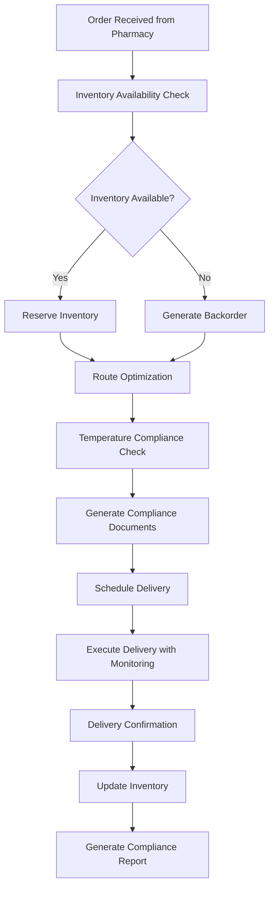
### 2. Temperature Monitoring & Alert Process
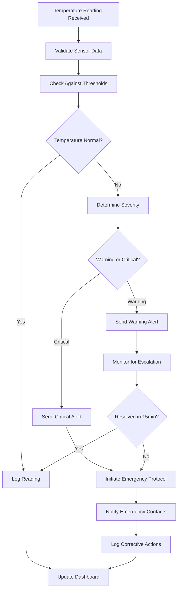
### 3. Emergency Medication Dispatch Process
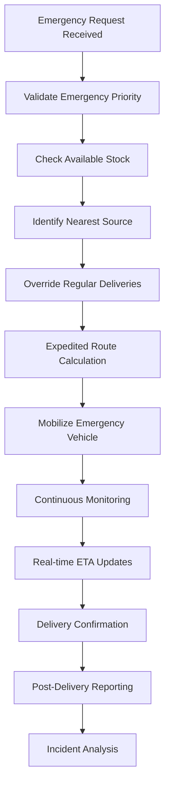
## System Integration Flows
### 4. PublicHealthOS Integration Flow
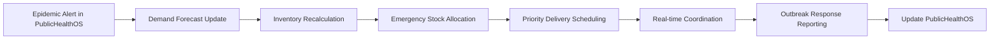
### 5. Regulatory Compliance Flow
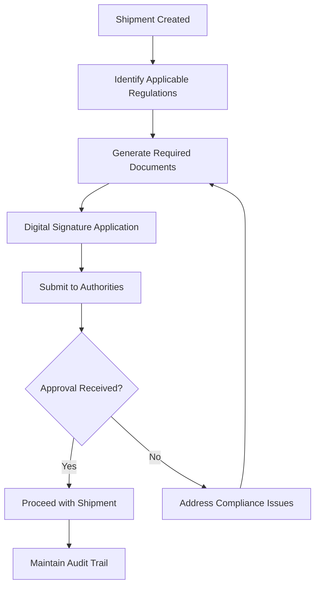
## Data Processing Flows
### 6. Route Optimization Flow
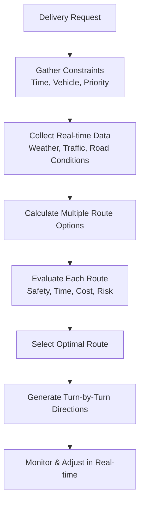
### 7. Inventory Management Flow
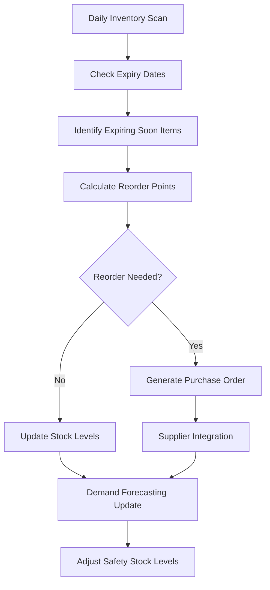
## Exception Handling Flows
### 8. Temperature Violation Response Flow
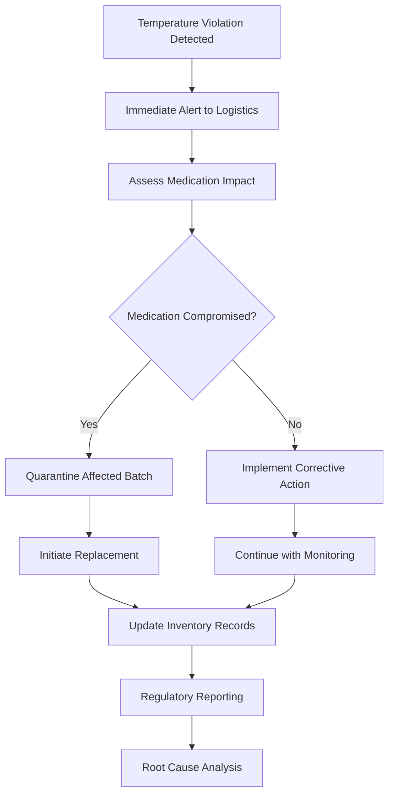
### 9. Delivery Exception Flow
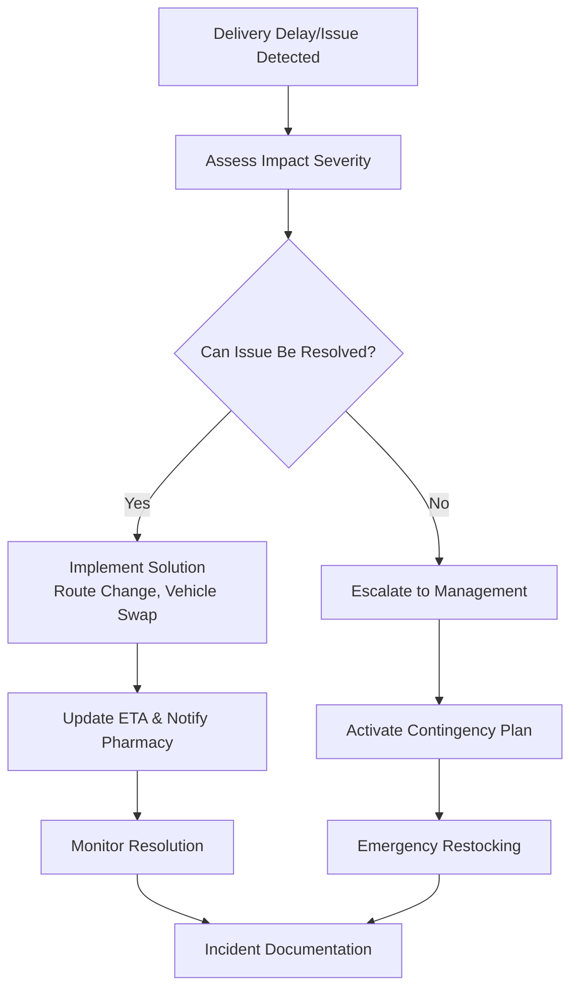
## User Interaction Flows
### 10. Pharmacy Manager Dashboard Flow
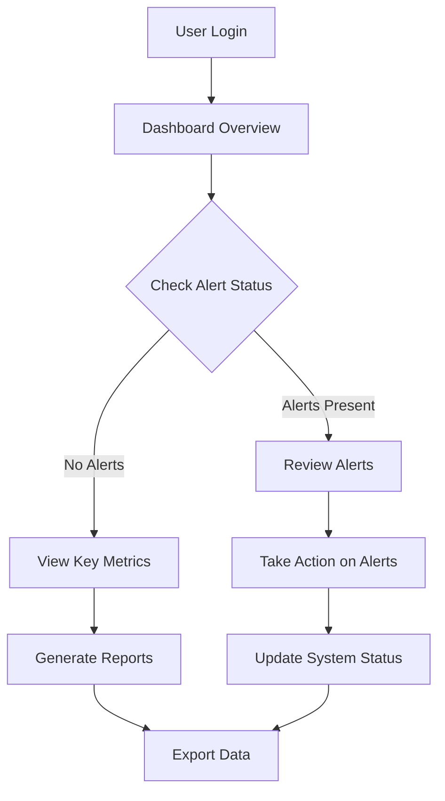
### 11. Mobile Field Operations Flow
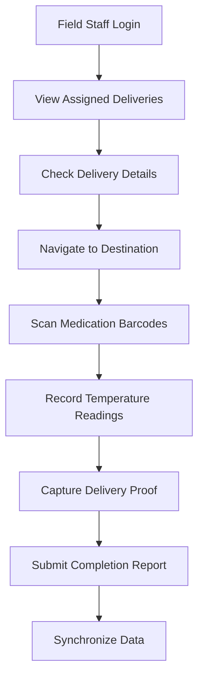
## Performance Monitoring Flows
### 12. KPI Calculation Flow

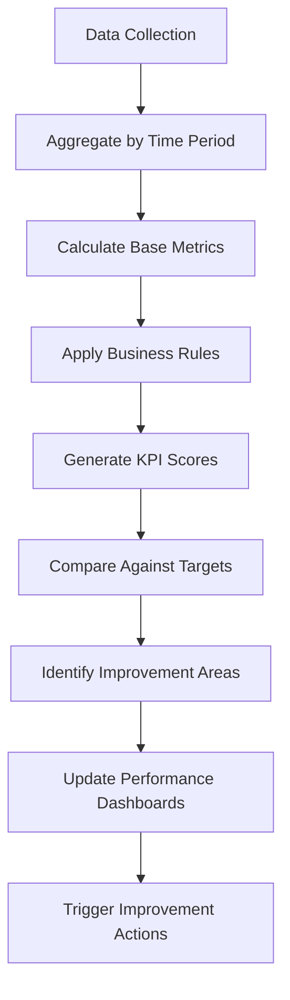
## Cross-Functional Collaboration Flows
### 13. Multi-Department Coordination Flow
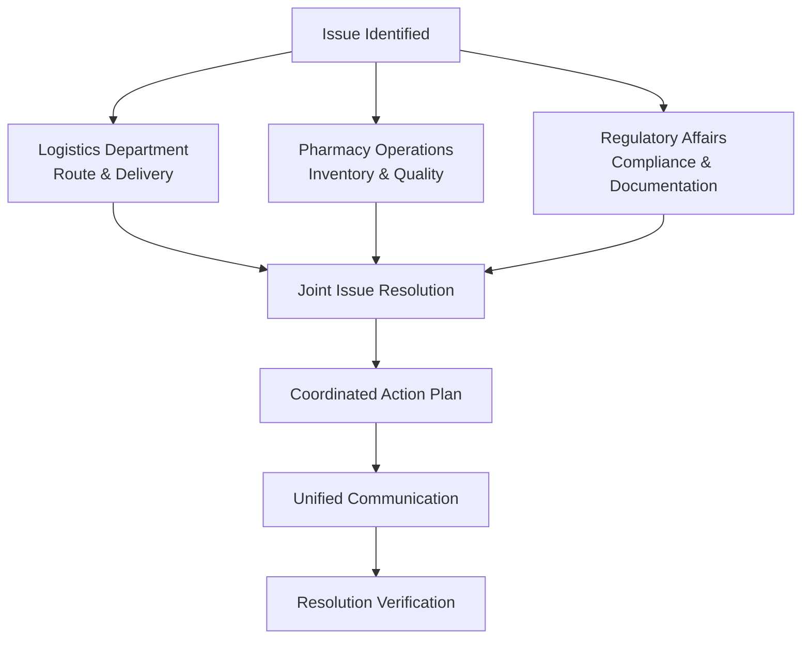
### Each process flow includes:

Trigger: What initiates the process

Key Decision Points: Critical branching logic

Exception Paths: Error and special case handling

Integration Points: Connections with other systems

Outcomes: Expected results and deliverables
